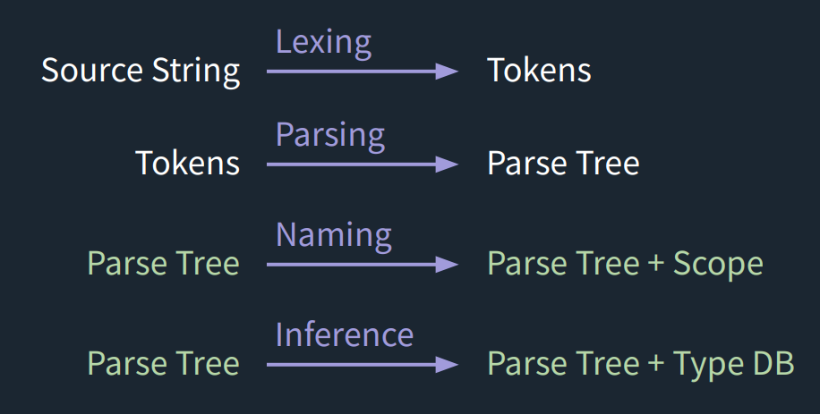

# 🛠️ Unify-JS — Lightweight Typed Superset for JavaScript

**Unify-JS** is a lightweight, **typed superset 🚀** of JavaScript that catches type errors early and keeps your codebase clean and maintainable—without any heavy setup

---

## ✨ Features

* 🔍 Detects type mismatches in variables, function calls, and expressions
* 🧠 Supports polymorphic functions (adaptable to multiple types)
* 📦 Zero configuration — install and run
* 💡 Clear CLI output for faster debugging

---

## 📦 Installation

```bash
npm install --save-dev @hareesh108/unify-js
```

---

## ⚡ Quick Start

1. Create your program:

```js
// myProgram.js
const double = (x) => { return x + x; };
const num = 5;
const str = "hello";

const doubledNum = double(num);
const mixed = double(num) + double(str); // ❌ Type error
```

2. Add to `package.json`:

```json
{
  "scripts": {
    "typecheck": "unify-js myProgram.js"
  }
}
```

3. Run:

```bash
npm run typecheck
```

---

## 🖥 Example Output

```plaintext
❌ Type mismatch in binary operation: cannot add Number to String
```

---

## 🧪 More Examples

✅ No type errors:

```js
const identity = (x) => { return x; };
const result = identity(42);
```

❌ Type mismatch:

```js
const add1 = (x) => { return x + 1; };
const res = add1("hello"); // Error
```

---

## 🛠 How It Works



* **compile** → Parses JavaScript into an AST
* **typeCheck** → Infers and validates types
* **nameCheck** → Checks naming and scope rules

---

## 📋 Roadmap

* 🌐 Enhanced CLI output with code highlighting
* 🧩 Plugin system for custom rules
* 🖍 VS Code integration

---

## 📜 License

MIT © 2025 [Hareesh Bhittam](https://github.com/Hareesh108/unify-js)
